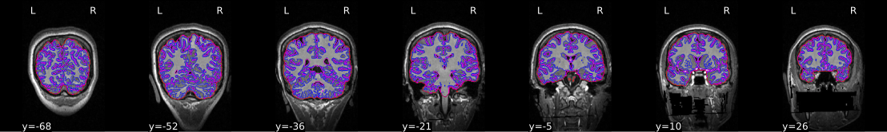
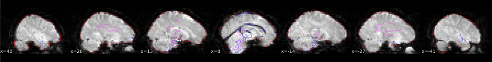

.. include:: links.rst

===========================
Processing pipeline details
===========================
*fMRIPrep* adapts its pipeline depending on what data and metadata are
available and are used as the input.
For example, slice timing correction will be
performed only if the ``SliceTiming`` metadata field is found for the input
dataset.

A (very) high-level view of the simplest pipeline (for a single-band dataset with only
one task, single-run, with no slice-timing information nor fieldmap acquisitions)
is presented below:

.. workflow::
    :graph2use: orig
    :simple_form: yes

    from fmriprep.workflows.tests import mock_config
    from fmriprep.workflows.base import init_single_subject_wf
    with mock_config():
        wf = init_single_subject_wf('01')

.. note::

   Each node in this workflow is either a processing node or a sub-workflow.
   Several conventions appear in this workflow that will be apparent throughout
   fMRIPrep.

   * ``inputnode``\s are special nodes that provide the runtime-generated inputs
     to a workflow. These are like function "arguments". There are corresponding
     ``outputnode``\s in most other workflows, which are like function return
     values.
   * Workflows end with ``_wf``, and are generated by a function of the form
     ``init_{workflow}_wf``.
     For example, ``anat_preproc_wf`` is a sub-workflow that is generated by the
     :func:`~smriprep.workflows.anatomical.init_anat_preproc_wf` (see below).
     Because each task and run of functional data is processed separately,
     :func:`~fmriprep.workflows.bold.base.init_bold_wf` names the
     resulting workflows using input parameters, resulting in
     ``func_preproc_task_{task}_run_{run}_wf``.
   * Datasinks begin with ``ds_``, and save files to the output directory.
     This is in contrast to most nodes, which save their outputs to the working
     directory. ``ds_report_`` nodes indicate that the node is saving text and
     figures for generating reports, rather than processed data.
   * When a name appears in parentheses, such as ``(reports)`` in ``about (reports)``
     it is the module where the interface is defined. In this case, ``about``
     is an :class:`~fmriprep.interfaces.reports.AboutSummary`, found in the
     :mod:`fmriprep.interfaces.reports` module.

Preprocessing of structural MRI
-------------------------------
The anatomical sub-workflow begins by constructing an average image by
conforming all found T1w images to RAS orientation and
a common voxel size, and, in the case of multiple images, averages them into a
single reference template (see `Longitudinal processing`_).

.. workflow::
    :graph2use: orig
    :simple_form: yes

    from niworkflows.utils.spaces import Reference, SpatialReferences
    from smriprep.workflows.anatomical import init_anat_preproc_wf
    spaces=SpatialReferences([
        ('MNI152Lin', {}),
        ('fsaverage', {'density': '10k'}),
        ('T1w', {}),
        ('fsnative', {})
    ])
    spaces.checkpoint()
    wf = init_anat_preproc_wf(
        bids_root='.',
        freesurfer=True,
        hires=True,
        longitudinal=False,
        omp_nthreads=1,
        output_dir='.',
        skull_strip_mode='force',
        skull_strip_template=Reference('MNI152NLin2009cAsym'),
        spaces=spaces,
        skull_strip_fixed_seed=False,
        t1w=['sub-01/anat/sub-01_T1w.nii.gz'],
        t2w=[],
        msm_sulc=True,
        precomputed={},
    )

.. important::

    Occasionally, openly shared datasets may contain preprocessed anatomical images
    as if they are unprocessed.
    In the case of brain-extracted (skull-stripped) T1w images, attempting to perform
    brain extraction again will often have poor results and may cause *fMRIPrep* to crash.
    *fMRIPrep* can attempt to detect these cases using a heuristic to check if the
    T1w image is already masked.
    This must be explicitly requested with ``---skull-strip-t1w auto``.
    If this heuristic fails, and you know your images are skull-stripped, you can skip brain
    extraction with ``--skull-strip-t1w skip``.
    Likewise, if you know your images are not skull-stripped and the heuristic incorrectly
    determines that they are, you can force skull stripping with ``--skull-strip-t1w force``,
    which is the current default behavior.

See also *sMRIPrep*'s
:py:func:`~smriprep.workflows.anatomical.init_anat_preproc_wf`.

.. _t1preproc_steps:

Brain extraction, brain tissue segmentation and spatial normalization
~~~~~~~~~~~~~~~~~~~~~~~~~~~~~~~~~~~~~~~~~~~~~~~~~~~~~~~~~~~~~~~~~~~~~
Then, the T1w reference is skull-stripped using a Nipype implementation of
the ``antsBrainExtraction.sh`` tool (ANTs), which is an atlas-based
brain extraction workflow:

.. workflow::
    :graph2use: orig
    :simple_form: yes

    from niworkflows.anat.ants import init_brain_extraction_wf
    wf = init_brain_extraction_wf()

Once the brain mask is computed, FSL ``fast`` is utilized for brain tissue segmentation.

fMRIPrep includes a single figure overlaying the brain mask (red), and tissue boundaries
(blue = gray/white; magenta = tissue/CSF):

    Brain extraction and segmentation report

Finally, spatial normalization to standard spaces is performed using ANTs' ``antsRegistration``
in a multiscale, mutual-information based, nonlinear registration scheme.
See :ref:`output-spaces` for information about how standard and nonstandard spaces can
be set to resample the preprocessed data onto the final output spaces.

.. figure:: _static/T1MNINormalization.svg

    Animation showing spatial normalization of T1w onto the ``MNI152NLin2009cAsym`` template.

Cost function masking during spatial normalization
~~~~~~~~~~~~~~~~~~~~~~~~~~~~~~~~~~~~~~~~~~~~~~~~~~
When processing images from patients with focal brain lesions (e.g., stroke, tumor
resection), it is possible to provide a lesion mask to be used during spatial
normalization to standard space [Brett2001]_.
ANTs will use this mask to minimize warping of healthy tissue into damaged
areas (or vice-versa).
Lesion masks should be binary NIfTI images (damaged areas = 1, everywhere else = 0)
in the same space and resolution as the T1w image, and use the ``_roi`` suffix,
for example, ``sub-001_label-lesion_roi.nii.gz``.
This file should be placed in the ``sub-*/anat`` directory of the BIDS dataset
to be run through *fMRIPrep*.
Because lesion masks are not currently part of the BIDS specification, it is also necessary to
include a ``.bidsignore`` file in the root of your dataset directory. This will prevent
`bids-validator <https://github.com/bids-standard/bids-validator#bidsignore>`_ from complaining
that your dataset is not valid BIDS, which prevents *fMRIPrep* from running.
Your ``.bidsignore`` file should include the following line::

  *lesion_roi.nii.gz

.. note::

   The lesion masking instructions in this section predate the release of BIDS Derivatives.
   As of BIDS 1.4.0, the recommended naming convention is::

       manual_masks/
       └─ sub-001/
          └─ anat/
             ├─ sub-001_desc-tumor_mask.nii.gz
             └─ sub-001_desc-tumor_mask.json

   In an upcoming version of fMRIPrep, we will search for lesion masks as pre-computed
   derivatives. Until this is supported, we will continue to look for the ``_roi`` suffix.

Longitudinal processing
~~~~~~~~~~~~~~~~~~~~~~~
In the case of multiple T1w images (across sessions and/or runs), T1w images are
merged into a single template image using FreeSurfer's `mri_robust_template`_.
This template may be *unbiased*, or equidistant from all source images, or
aligned to the first image (determined lexicographically by session label).
For two images, the additional cost of estimating an unbiased template is trivial,
but aligning three or more images is too expensive to justify being the default behavior.
For consistency, in the case of multiple images, *fMRIPrep* constructs
templates aligned to the first image, unless passed the ``--longitudinal``
flag, which forces the estimation of an unbiased template.

.. note::

    The preprocessed T1w image defines the ``T1w`` space.
    In the case of multiple T1w images, this space may not be precisely aligned
    with any of the original images.
    Reconstructed surfaces and functional datasets will be registered to the
    ``T1w`` space, and not to the input images.

.. _workflows_surface:

Surface preprocessing
~~~~~~~~~~~~~~~~~~~~~
*fMRIPrep* uses FreeSurfer_ to reconstruct surfaces from T1w/T2w
structural images.
If enabled, several steps in the *fMRIPrep* pipeline are added or replaced.
All surface preprocessing may be disabled with the ``--fs-no-reconall`` flag.

.. note::
    Surface processing will be skipped if the outputs already exist.

    In order to bypass reconstruction in *fMRIPrep*, place existing reconstructed
    subjects in ``<output dir>/sourcedata/freesurfer`` prior to the run, or specify
    an external subjects directory with the ``--fs-subjects-dir`` flag.
    *fMRIPrep* will perform any missing ``recon-all`` steps, but will not perform
    any steps whose outputs already exist.

If FreeSurfer reconstruction is performed, the reconstructed subject is placed in
``<output dir>/sourcedata/freesurfer/sub-<subject_label>/`` (see :ref:`fsderivs`).

Surface reconstruction is performed in three phases.
The first phase initializes the subject with T1w and T2w (if available)
structural images and performs basic reconstruction (``autorecon1``) with the
exception of skull-stripping.
Skull-stripping is skipped since the brain mask :ref:`calculated previously
<t1preproc_steps>` is injected into the appropriate location for FreeSurfer.
For example, a subject with only one session with T1w and T2w images
would be processed by the following command::

    $ recon-all -sd <output dir>/freesurfer -subjid sub-<subject_label> \
        -i <bids-root>/sub-<subject_label>/anat/sub-<subject_label>_T1w.nii.gz \
        -T2 <bids-root>/sub-<subject_label>/anat/sub-<subject_label>_T2w.nii.gz \
        -autorecon1 \
        -noskullstrip

The second phase imports the brainmask calculated in the
`Preprocessing of structural MRI`_ sub-workflow.
The final phase resumes reconstruction, using the T2w image to assist
in finding the pial surface, if available.
See :py:func:`~smriprep.workflows.surfaces.init_autorecon_resume_wf` for
details.

Reconstructed white and pial surfaces are included in the report.

.. figure:: _static/reconall.svg

    Surface reconstruction (FreeSurfer)

If T1w voxel sizes are less than 1mm in all dimensions (rounding to nearest
.1mm), `submillimeter reconstruction`_ is used, unless disabled with
``--no-submm-recon``.

If T2w or FLAIR images are available, and you do not want them included in
FreeSurfer reconstruction, use ``--ignore t2w`` or ``--ignore flair``,
respectively.

``lh.midthickness`` and ``rh.midthickness`` surfaces are created in the subject
``surf/`` directory, corresponding to the surface half-way between the gray/white
boundary and the pial surface.
The ``smoothwm``, ``midthickness``, ``pial`` and ``inflated`` surfaces are also
converted to GIFTI_ format and adjusted to be compatible with multiple software
packages, including FreeSurfer and the `Connectome Workbench`_.

.. note::
    GIFTI surface outputs are aligned to the FreeSurfer ``T1.mgz`` image, which
    may differ from the T1w space in some cases, to maintain compatibility
    with the FreeSurfer directory.
    Any measures sampled to the surface take into account any difference in
    these images.

.. workflow::
    :graph2use: orig
    :simple_form: yes

    from smriprep.workflows.surfaces import init_surface_recon_wf
    wf = init_surface_recon_wf(
        omp_nthreads=1, hires=True, precomputed={}, fs_no_resume=False,
    )

See also *sMRIPrep*'s
:py:func:`~smriprep.workflows.surfaces.init_surface_recon_wf`

Refinement of the brain mask
~~~~~~~~~~~~~~~~~~~~~~~~~~~~
Typically, the original brain mask calculated with ``antsBrainExtraction.sh``
will contain some inaccuracies including small amounts of MR signal from
outside the brain.
Based on the tissue segmentation of FreeSurfer (located in ``mri/aseg.mgz``)
and only when the :ref:`Surface Processing <workflows_surface>` step has been
executed, *fMRIPrep* replaces the brain mask with a refined one that derives
from the ``aseg.mgz`` file as described in
:py:class:`~niworkflows.interfaces.freesurfer.RefineBrainMask`.

BOLD preprocessing
------------------
*fMRIPrep* performs a series of steps to preprocess :abbr:`BOLD (blood-oxygen level-dependent)`
data. Broadly, these are split into fit and transform stages.

The following figures show the overall workflow graph and the ``bold_fit_wf``
subgraph:

:py:func:`~fmriprep.workflows.bold.base.init_bold_wf`

.. workflow::
    :graph2use: orig
    :simple_form: yes

    from fmriprep.workflows.tests import mock_config
    from fmriprep import config
    from fmriprep.workflows.bold.base import init_bold_wf
    with mock_config():
        bold_file = config.execution.bids_dir / 'sub-01' / 'func' \
            / 'sub-01_task-mixedgamblestask_run-01_bold.nii.gz'
        wf = init_bold_wf(bold_series=[str(bold_file)])

.. _bold_fit:

:py:func:`~fmriprep.workflows.bold.fit.init_bold_fit_wf`

.. workflow::
    :graph2use: orig
    :simple_form: yes

    from fmriprep.workflows.tests import mock_config
    from fmriprep import config
    from fmriprep.workflows.bold.fit import init_bold_fit_wf
    with mock_config():
        bold_file = config.execution.bids_dir / 'sub-01' / 'func' \
            / 'sub-01_task-mixedgamblestask_run-01_bold.nii.gz'
        wf = init_bold_fit_wf(bold_series=[str(bold_file)], fieldmap_id="fmap")

Preprocessing of :abbr:`BOLD (blood-oxygen level-dependent)` files is
split into multiple sub-workflows described below.

.. _bold_ref:

BOLD reference image estimation
~~~~~~~~~~~~~~~~~~~~~~~~~~~~~~~
:py:func:`~fmriprep.workflows.bold.reference.init_raw_boldref_wf`

.. workflow::
    :graph2use: orig
    :simple_form: yes

    from fmriprep.workflows.bold.reference import init_raw_boldref_wf
    wf = init_raw_boldref_wf()

This workflow estimates a reference image for a
:abbr:`BOLD (blood-oxygen level-dependent)` series as follows:
When T1-saturation effects ("dummy scans" or non-steady state volumes) are
detected, they are averaged and used as reference due to their
superior tissue contrast.
Otherwise, a median of motion corrected subset of volumes is used.

This reference is used for :ref:`head-motion estimation <bold_hmc>`.

For the :ref:`registration workflow <bold_reg>`, the reference image is
either the above described reference image or a single-band reference,
if one is found in the input dataset.
In either case, this image is contrast-enhanced and skull-stripped
(see :py:func:`~niworkflows.func.util.init_enhance_and_skullstrip_bold_wf`).
If fieldmaps are present, the skull-stripped reference is corrected
prior to registration.

    The red contour shows the brain mask estimated for a BOLD reference volume.
    The blue and magenta contours show the tCompCor and aCompCor masks,
    respectively. (See :ref:`bold_confounds`, below.)

.. _bold_hmc:

Head-motion estimation
~~~~~~~~~~~~~~~~~~~~~~
:py:func:`~fmriprep.workflows.bold.hmc.init_bold_hmc_wf`

.. workflow::
    :graph2use: colored
    :simple_form: yes

    from fmriprep.workflows.bold import init_bold_hmc_wf
    wf = init_bold_hmc_wf(
        mem_gb=1,
        omp_nthreads=1)

Using the previously :ref:`estimated reference scan <bold_ref>`,
FSL ``mcflirt`` is used to estimate head-motion.
As a result, one rigid-body transform with respect to
the reference image is written for each :abbr:`BOLD (blood-oxygen level-dependent)`
time-step.
Additionally, a list of 6-parameters (three rotations,
three translations) per time-step is written and fed to the
:ref:`confounds workflow <bold_confounds>`.
For a more accurate estimation of head-motion, we calculate its parameters
before any time-domain filtering (i.e., :ref:`slice-timing correction <bold_stc>`),
as recommended in [Power2017]_.

.. _bold_stc:

Slice time correction
~~~~~~~~~~~~~~~~~~~~~
:py:func:`~fmriprep.workflows.bold.stc.init_bold_stc_wf`

.. workflow::
    :graph2use: colored
    :simple_form: yes

    from fmriprep.workflows.bold import init_bold_stc_wf
    wf = init_bold_stc_wf(
        mem_gb={'filesize': 1},
        metadata={'RepetitionTime': 2.0,
                  'SliceTiming': [0.0, 0.1, 0.2, 0.3, 0.4, 0.5, 0.6, 0.7, 0.8, 0.9]},
    )

If the ``SliceTiming`` field is available within the input dataset metadata,
this workflow performs slice time correction prior to other signal resampling
processes.
Slice time correction is performed using AFNI ``3dTShift``.
All slices are realigned in time to the middle of each TR.

Slice time correction can be disabled with the ``--ignore slicetiming``
command line argument.
If a :abbr:`BOLD (blood-oxygen level-dependent)` series has fewer than
5 usable (steady-state) volumes, slice time correction will be disabled
for that run.

Susceptibility Distortion Correction (SDC)
~~~~~~~~~~~~~~~~~~~~~~~~~~~~~~~~~~~~~~~~~~
One of the major problems that affects :abbr:`EPI (echo planar imaging)` data
is the spatial distortion caused by the inhomogeneity of the field inside
the scanner.

.. figure:: _static/unwarping.svg

    Applying susceptibility-derived distortion correction, based on
    fieldmap estimation.

Please note that all routines for susceptibility-derived distortion correction
have been excised off of *fMRIPrep* for utilization on other projects
(e.g., `dMRIPrep <https://www.nipreps.org/dmriprep>`__).
For more detailed documentation on
:abbr:`SDC (susceptibility-derived distortion correction)`
routines, check on the `SDCFlows component <https://www.nipreps.org/sdcflows>`__.

Theory, methods and references are found within the
`SDCFlows documentation <https://www.nipreps.org/sdcflows/master/api/sdcflows.workflows.fit.fieldmap.html>`__.

Pre-processed BOLD in native space
~~~~~~~~~~~~~~~~~~~~~~~~~~~~~~~~~~
:py:func:`~fmriprep.workflows.bold.fit.init_bold_native_wf`

.. workflow::
    :graph2use: orig
    :simple_form: yes

    from fmriprep.workflows.tests import mock_config
    from fmriprep import config
    from fmriprep.workflows.bold.fit import init_bold_native_wf
    with mock_config():
        bold_file = config.execution.bids_dir / 'sub-01' / 'func' \
            / 'sub-01_task-mixedgamblestask_run-01_bold.nii.gz'
        wf = init_bold_native_wf(bold_series=[str(bold_file)], fieldmap_id='fmap')

A new *preproc* :abbr:`BOLD (blood-oxygen level-dependent)` series is generated
from the slice-timing corrected or the original data (if
:abbr:`STC (slice-timing correction)` was not applied) in the
original space.
All volumes in the :abbr:`BOLD (blood-oxygen level-dependent)` series are
resampled in their native space by concatenating the mappings found in previous
correction workflows (:abbr:`HMC (head-motion correction)` and
:abbr:`SDC (susceptibility-derived distortion correction)` if executed)
for a one-shot interpolation process.
Interpolation uses a Lanczos kernel.

.. _bold_reg:

EPI to T1w registration
~~~~~~~~~~~~~~~~~~~~~~~
:py:func:`~fmriprep.workflows.bold.registration.init_bbreg_wf`

.. workflow::
    :graph2use: hierarchical
    :simple_form: yes

    from fmriprep.workflows.bold.registration import init_bbreg_wf
    wf = init_bbreg_wf(
        omp_nthreads=1,
        use_bbr=True,
        bold2anat_dof=9,
        bold2anat_init='t2w',
    )

The alignment between the reference :abbr:`EPI (echo-planar imaging)` image
of each run and the reconstructed subject using the gray/white matter boundary
(FreeSurfer's ``?h.white`` surfaces) is calculated by the ``bbregister`` routine.
See :func:`fmriprep.workflows.bold.registration.init_bbreg_wf` for further details.

.. figure:: _static/EPIT1Normalization.svg

    Animation showing :abbr:`EPI (echo-planar imaging)` to T1w registration (FreeSurfer ``bbregister``)

If FreeSurfer processing is disabled, FSL ``flirt`` is run with the
:abbr:`BBR (boundary-based registration)` cost function, using the
``fast`` segmentation to establish the gray/white matter boundary.
See :func:`fmriprep.workflows.bold.registration.init_fsl_bbr_wf` for further details.

After either :abbr:`BBR (boundary-based registration)` workflow is run, the resulting affine
transform will be compared to the initial transform found by FLIRT.
Excessive deviation will result in rejecting the BBR refinement and accepting the
original, affine registration.

Resampling BOLD runs onto standard spaces
~~~~~~~~~~~~~~~~~~~~~~~~~~~~~~~~~~~~~~~~~
:py:func:`~fmriprep.workflows.bold.apply.init_bold_volumetric_resample_wf`

.. workflow::
    :graph2use: colored
    :simple_form: yes

    from fmriprep.workflows.bold.apply import init_bold_volumetric_resample_wf
    wf = init_bold_volumetric_resample_wf(
        metadata={
            'RepetitionTime': 2.0,
            'PhaseEncodingDirection': 'j-',
            'TotalReadoutTime': 0.03
        },
        mem_gb={'resampled': 1},
        jacobian=True,
        fieldmap_id='fmap',
    )

This sub-workflow concatenates the transforms calculated upstream (see
`Head-motion estimation`_, `Susceptibility Distortion Correction (SDC)`_ --if
fieldmaps are available--, `EPI to T1w registration`_, and an anatomical-to-standard
transform from `Preprocessing of structural MRI`_) to map the
:abbr:`EPI (echo-planar imaging)`
image to the standard spaces given by the ``--output-spaces`` argument
(see :ref:`output-spaces`).
It also maps the T1w-based mask to each of those standard spaces.

Transforms are concatenated and applied all at once, with one interpolation (Lanczos)
step, so as little information is lost as possible.

The output space grid can be specified using modifiers to the ``--output-spaces``
argument.

EPI sampled to FreeSurfer surfaces
~~~~~~~~~~~~~~~~~~~~~~~~~~~~~~~~~~
:py:func:`~fmriprep.workflows.bold.resampling.init_bold_surf_wf`

.. workflow::
    :graph2use: colored
    :simple_form: yes

    from fmriprep.workflows.bold import init_bold_surf_wf
    wf = init_bold_surf_wf(
        mem_gb=1,
        surface_spaces=['fsnative', 'fsaverage5'],
        medial_surface_nan=False,
        metadata={},
        output_dir='.',
    )

If FreeSurfer processing is enabled, the motion-corrected functional series
(after single shot resampling to T1w space) is sampled to the
surface by averaging across the cortical ribbon.
Specifically, at each vertex, the segment normal to the white-matter surface, extending to the pial
surface, is sampled at 6 intervals and averaged.

Surfaces are generated for the "subject native" surface, as well as transformed to the
``fsaverage`` template space.
All surface outputs are in GIFTI format.

HCP Grayordinates
~~~~~~~~~~~~~~~~~
:py:func:`~fmriprep.workflows.bold.resampling.init_bold_fsLR_resampling_wf`

.. workflow::
    :graph2use: orig
    :simple_form: yes

    from fmriprep.workflows.bold.resampling import init_bold_fsLR_resampling_wf
    wf = init_bold_fsLR_resampling_wf(
        grayord_density='92k',
        omp_nthreads=1,
        mem_gb=1,
    )

If CIFTI output is enabled, the motion-corrected functional timeseries (in T1w space) is
resampled onto the subject-native surface, optionally using the `HCP Pipelines_`'s
"goodvoxels" masking method to exclude voxels with local peaks of temporal variation.
After dilating the surface-sampled time series to fill sampling holes, the result is
resampled to the ``fsLR`` mesh (with the left and right hemisphere aligned).
These workflows make use of various `Connectome Workbench`_ functions.
These surfaces are then combined with corresponding volumetric timeseries to create a
CIFTI-2 file.

.. _bold_confounds:

Confounds estimation
~~~~~~~~~~~~~~~~~~~~
:py:func:`~fmriprep.workflows.bold.confounds.init_bold_confs_wf`

.. workflow::
    :graph2use: colored
    :simple_form: yes

    from fmriprep.workflows.bold.confounds import init_bold_confs_wf
    wf = init_bold_confs_wf(
        name="discover_wf",
        mem_gb=1,
        metadata={"RepetitionTime": 2.0,
                  "SliceTiming": [0.0, 0.1, 0.2, 0.3, 0.4, 0.5, 0.6, 0.7, 0.8, 0.9]},
        regressors_all_comps=False,
        regressors_dvars_th=1.5,
        regressors_fd_th=0.5,
    )

Given a motion-corrected fMRI, a brain mask, ``mcflirt`` movement parameters and a
segmentation, the `discover_wf` sub-workflow calculates potential
confounds per volume.

Calculated confounds include the mean global signal, mean tissue class signal,
tCompCor, aCompCor, Frame-wise Displacement, 6 motion parameters, DVARS, and
spike regressors.

.. _bold_t2s:

T2*-driven echo combination
~~~~~~~~~~~~~~~~~~~~~~~~~~~
:py:func:`~fmriprep.workflows.bold.t2s.init_bold_t2s_wf`

.. workflow::
    :graph2use: colored
    :simple_form: yes

    from fmriprep.workflows.bold.t2s import init_bold_t2s_wf
    wf = init_bold_t2s_wf(
        echo_times=[0.015, 0.030, 0.045],
        mem_gb=1,
        omp_nthreads=1,
    )

If multi-echo :abbr:`BOLD (blood-oxygen level-dependent)` data is supplied,
this workflow uses the `tedana`_ `T2* workflow`_ to generate an adaptive T2* map
and optimally weighted combination of all supplied single echo time series.
This optimally combined time series is then carried forward for all subsequent
preprocessing steps.

The method by which T2* and S0 are estimated is determined by the ``--me-t2s-fit-method`` parameter.
The default method is "curvefit", which uses nonlinear regression to estimate T2* and S0.
The other option is "loglin", which uses log-linear regression.
The "loglin" option is faster and less memory intensive,
but it may be less accurate than "curvefit".

References
----------

.. [Power2017] Power JD, Plitt M, Kundu P, Bandettini PA, Martin A (2017) Temporal interpolation alters
    motion in fMRI scans: Magnitudes and consequences for artifact detection. PLOS ONE 12(9): e0182939.
    doi:`10.1371/journal.pone.0182939 <https://doi.org/10.1371/journal.pone.0182939>`_.

.. [Brett2001] Brett M, Leff AP, Rorden C, Ashburner J (2001) Spatial Normalization of Brain Images with
    Focal Lesions Using Cost Function Masking. NeuroImage 14(2)
    doi:`10.006/nimg.2001.0845 <https://doi.org/10.1006/nimg.2001.0845>`_.
