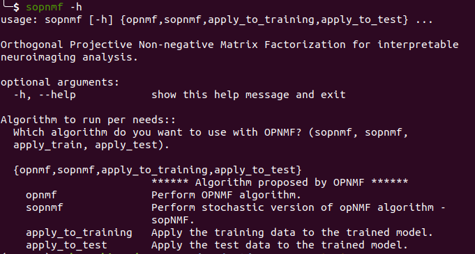

<p align="center">
  
</p>

# SOPNMF documentation
SOPNMF is the python implementation of the Matlab version of Orthogonal Projective Non-negative Matrix Factorization: [brainparts](https://github.com/asotiras/brainparts), and its stochastic extension.

## Installation
[Ananconda](https://www.anaconda.com/products/individual) allows you to install, run and update python package and their dependencies. We highly recommend the users to install **Anancond3** on your machine. We also assume that the users should be familiar with command-line operations with the Linux system.
There exist three ways to use the current software.
#### Install SOPNMF as a python package
Please follow the instructions to install SOPNMF as a python package:
```
i) conda create --name sopNMF python=3.6
```
Activate the virtual environment:
```
ii) source activate sopNMF
```
Install other python package dependencies (go to the root folder of sopNMF; I only tested the package versions listed in the bash file.):
```
iii) ./install_requirements.sh
```
Finally, we need install sopNMF from PyPi:
```
iv) pip install sopnmf==0.0.2
```

#### Use sopNMF from command-line in a terminal
First, you need to go the root directory of your local repository, and then run:
```
pip install -e .
```
This will allow you to run the software as command-line in the terminal. See an example here:
<p align="center">
  
</p>

#### Use SOPNMF as a developer version
Advanced users can git clone the package locally and work from the source code:
```
python -m pip install git+https://github.com/anbai106/SOPNMF.git
```

## Input structure
sopNMF requires the input (*participant_tsv*) to be a specific structure inspired by [BIDS](https://bids.neuroimaging.io/). The 3 columns in the tsv are **participant_id**, **session_id** and **path**, respectively.

Example for participant tsv:
```
participant_id    session_id    path
sub-CLNC0001      ses-M00      absolute_path    
sub-CLNC0002      ses-M00      absolute_path
sub-CLNC0003      ses-M00      absolute_path
sub-CLNC0004      ses-M00      absolute_path
sub-CLNC0005      ses-M00      absolute_path
sub-CLNC0006      ses-M00      absolute_path
sub-CLNC0007      ses-M00      absolute_path
sub-CLNC0008      ses-M00      absolute_path
```

## Examples to run SOPNMF

#### First, if you have a population with a small to medium sample size, you can try to run the OPNMF model:
```
from sopnmf.opnmf_core import opnmf
participant_tsv="path_to_participant_tsv"
output_dir = "path_output_dir"
tissue_binary_mask = "path_to_tissue_mask"
num_component_min = 2
num_component_max = 60
n_threads = 8
verbose = True
opnmf(participant_tsv, output_dir, tissue_binary_mask, num_component_min, num_component_max, n_threads=n_threads, verbose=verbose)
```

#### Alternatively, if you have a large <em>N</em>, you can train the model with the SOPNMF model to overcome the memory limitations:
```
from sopnmf.opnmf_core import sopnmf
participant_tsv="path_to_participant_tsv"
participant_tsv_max_memory="path_to_participant_tsv_with_max_N"
output_dir = "path_output_dir"
tissue_binary_mask = "path_to_tissue_mask"
num_component_min = 2
num_component_max = 60
n_threads = 8
verbose = True
sopnmf(participant_tsv, output_dir, tissue_binary_mask, num_component_min, num_component_max, n_threads=n_threads, verbose=verbose)
```

#### Second, you need to apply the trained model to the training data for post-hoc analyses:
```
from sopnmf.opnmf_post import apply_to_training
output_dir = "path_output_dir"
tissue_binary_mask = "path_to_tissue_mask"
num_component = 2
apply_to_training(output_dir, num_component, tissue_binary_mask, verbose=True)
```

#### Last, you may also apply the trained model to unseen test data:
```
from sopnmf.opnmf_post import apply_to_test
participant_tsv="path_to_participant_tsv"
tissue_binary_mask = "path_to_tissue_mask"
num_component = 2
output_dir = "path_output_dir"
apply_to_test(output_dir, num_component, tissue_binary_mask, participant_tsv, verbose=True)
```

## Citing this work
> Sotiras, A., Resnick, S.M. and Davatzikos, C., 2015. **Finding imaging patterns of structural covariance via non-negative matrix factorization**. Neuroimage, 108, pp.1-16. [doi:10.1016/j.neuroimage.2014.11.045](https://www.sciencedirect.com/science/article/pii/S1053811914009756?via%3Dihub)

## Publications using SOPNMF
> Wen, J., Varol, E., Sotiras, A., Yang, Z., Chand, G.B., Erus, G., Shou, H., Abdulkadir, A., Hwang, G., Dwyer, D.B. and Pigoni, A., 2022. Multi-scale semi-supervised clustering of brain images: deriving disease subtypes. Medical Image Analysis, 75, p.102304. - [Link](https://scholar.google.com/citations?view_op=view_citation&hl=en&user=4Wq_FukAAAAJ&sortby=pubdate&citation_for_view=4Wq_FukAAAAJ:9ZlFYXVOiuMC)
