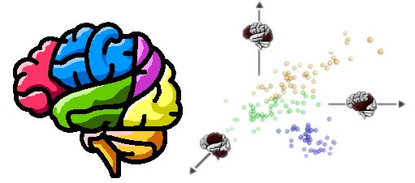
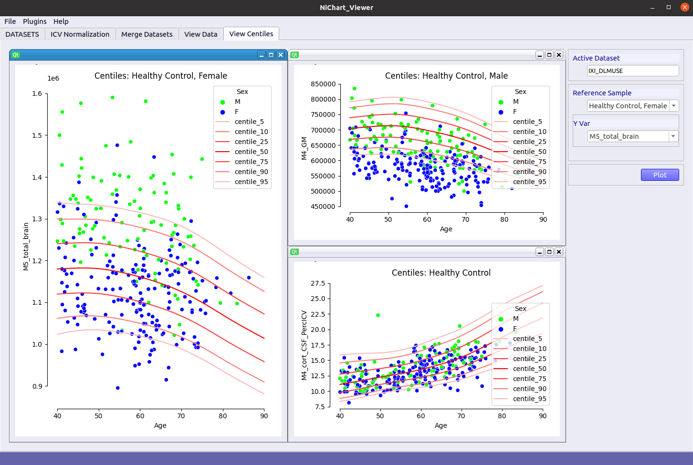

# Neuroimaging Chart (NiChart) Viewer



NiChart viewer **[NiChart_Viewer]** is a toolbox for visualization of NiChart image descriptors and biomarkers. 

## Notes

The current version is primarily designed for visualizing NiChart_DLMUSE variables (regions of interest - ROIs) together with age centile curves of select ROIs derived from NiChart reference data.

## Installation

You may directly install NiChart_Viewer as a package from PyPI, or build it from source. 

```bash
conda create -n NiChart_Viewer python=3.8.8
conda activate NiChart_Viewer
conda install pip
pip install .
```

Alternatively:

```bash
conda create -n NiChart_Viewer python=3.8.8
conda activate NiChart_Viewer
pip install NiChart_Viewer
```

## Usage

```bash
NiChart_Viewer --data_file infile1.csv --data_file infile2.csv ...
```

## Quickstart

```bash
cd examples/IXI_ROIs
./run_nichart_viewer_IXI.sh
```

The script launches the viewer using the public IXI dataset as an example (DLMUSE ROIs + demog. file with Age and Sex columns).

After launching the viewer, users can view data tables and select ROIs, correct ROIs for intra-cranial volume (ICV), merge ROI values with demographic variables (Age and Sex), view data distributions and scatter plots of variable pairs, and plot selected variables against NiChart reference centile curves




## Disclaimer
- The software has been designed for research purposes only and has neither been reviewed nor approved for clinical use by the Food and Drug Administration (FDA) or by any other federal/state agency.
- By using NiChart_Viewer, the user agrees to the following license: https://www.med.upenn.edu/cbica/software-agreement-non-commercial.html

## Contact
<a href="mailto:guray.erus@pennmedicine.upenn.edu">Guray Erus</a>.
